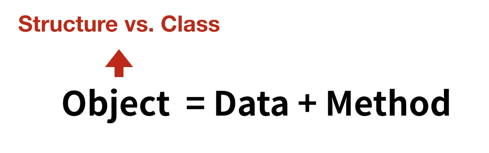
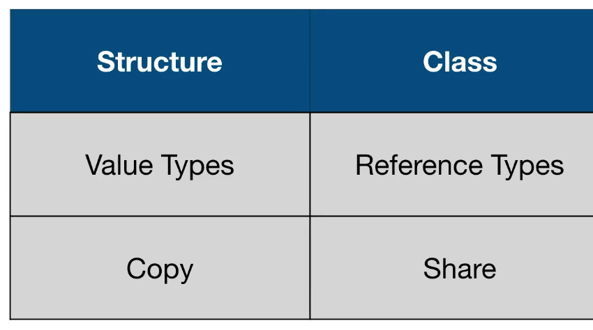
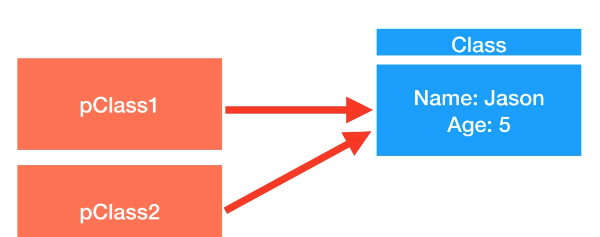
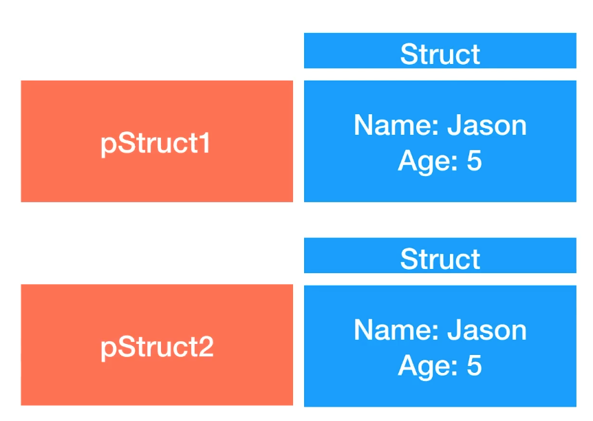

### Class

---

Structure 그리고 Class는 **관계가 있는 것들을 묶어서 표현 한 것!**



또한, **Data = Property, Method = Method** 로 볼 수 있다.

structure와 class는 개념적으로는 동일하나 **차이점이 하나 있다**고 전 시간에 정리했다.



structure와 class의 차이를 더 쉽게 표현하기 위해 그림을 빌려보자면

#### Class



#### Structure



이렇게 보면 이해하기 더 쉬울 것이다.

structure (Stack)와 class (Heap)는 **메모리에 할당되는 공간이 다르기 때문에** 다른 동작성을 나타낸다.

두 영역의 차이점을 간단하게 살펴보자면

#### Stack

* 매우 빠른 액세스
* 변수를 명시적으로 할당 해제 할 필요가 없다.
* 공간은 CPU에 의해 효율적으로 관리되고 메모리는 단편화되지 않는다.
* 지역 변수
* 스택 크기 제한 (OS에 따라 다르다)
* 변수의 크기를 조정 할 수 있다.

<br>

#### Heap

* 변수는 전역적으로 액세스 할 수 있다.

* 메모리 크기 제한 없다.

* (상대적으로) 느린 액세스

* 효율적인 공간 사용을 보장하지 못하면 메모리 블록이 할당 된 후 시간이 지남에 따라 메모리가 조각화 되어

  해제 될 수 있다.

* 메로리를 관리해야 한다. (변수를 할당하고 해제하는 책임이 있다.)

<br>

<br>

### Struct vs. Class	언제, 무엇을 쓸까

---

#### 이럴 때 Struct를 쓰자

* 두 object를 "같다, 다르다"로 비교해야 하는 경우

  ``` swift
  let point1 = Point(x: 3, y: 5)
  let point2 = Point(x: 3, y: 5)
  ```

* Copy된 각 객체들이 독립적인 상태를 가져야 하는 경우

  ``` swift
  var myMac = Mac(owner: "Jason")
  var yourMac = myMac
  yourMac.owner = "Jay"
  
  myMac.owner
  yourMac.owner
  ```

* 코드에서 object의 데이터를 여러 스레드 걸쳐 사용할 경우

<br>

#### 이럴 때 Class를 쓰자

* 두 object의 인스턴스 자체가 같음을 확인해야 할 때

* 하나의 객체가 필요하고, 여러 대상에 의해 접근되고 변경이 필요한 경우

  예를들어, 앱 개발할 때 UIApplication 이라는 객체가 있는데 앱 구동에 있어서 유일한 하나의 객체이다.

  그런데 앱 내 여러 object들에 의해서 접근이 될 필요가 있다. 이런 경우에 class로 만든다.

<br>

#### 쉽게 설명하기!

1. **일단 웬만한 object는 Struct로 쓰자** 그리고 필요하다면 class로 변경하자
   * Swift는 Struct를 좋아한다.
     * swift 1.2
       * struct: 81
       * enum: 8
       * class: 3
     * swift 2.0
       * struct: 87
       * enum: 8
       * class: 4
     * swift 3.0
       * struct: 124
       * enum: 19
       * class: 3

<br>

<br>

### 상속 (Inheritance)

---

class는 method, property와 다른 특징을 다른 class로 부터 상속할 수 있다.

이것이 swift에서 class가 다른 타입과 구분되는 근본적인 요소이다.

class에서 stored property와 computed property와 상관 없이 상속 받은 property에

property observer를 설정해서 값 설정에 반응 할 수 있다.

``` swift
struct Grade {
    var letter: Character
    var points: Double
    var credits: Double
}

class Person {
    var firstName: String
    var lastName: String
    
    init(firstName: String, lastName: String) {
        self.firstName = firstName
        self.lastName = lastName
    }
    
    func printMyName() {
        print("My name is \(firstName) \(lastName)")
    }
}

class Student: Person {
    var grades: [Grade] = []
}
```

위 코드에서

Person : Super Class (Parent Class)

Student: Sub Class (Child Class)

<br>

#### 상속의 규칙

* 자식은 한개의 super class만 상속 받는다.
* 부모는 여러 자식들을 가질 수 있다.
* 상속의 깊이는 상관이 없다.

<br>

#### 상속은 언제 하면 좋을까?

1. Single Responsibility (단일 책임)

   각 class는 한개의 고려 사항만 있으면 된다.

2. Type Safety (타입이 분명해야 할 때)

3. Shared Base Classes (다자녀가 있다)

4. Extensibility (확장성이 필요한 경우)

5. Identity (정체를 파악하기 위해)

<br>

#### designated vs. convenience

* DI는 자신의 부모의 DI를 호출해야 한다.
* CI는 같은 class의 initializer를 꼭 하나 호출해야 한다.
* CI는 궁극적으로 DI를 호출해야 한다.