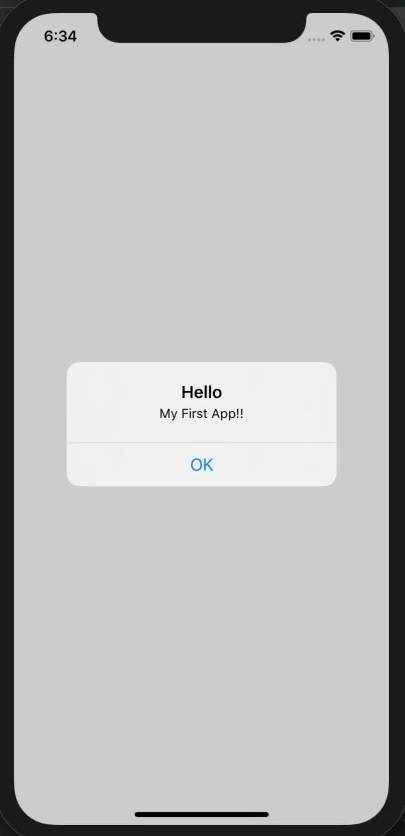
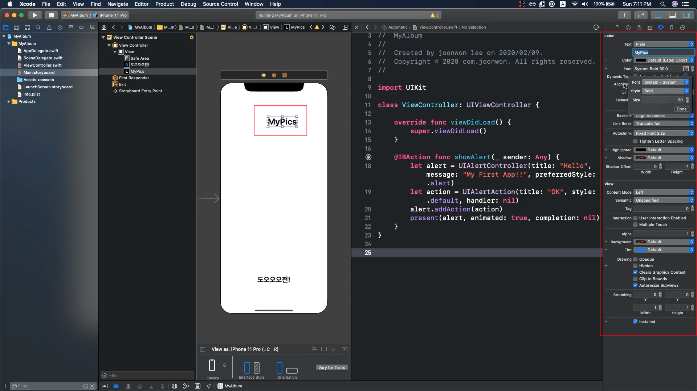
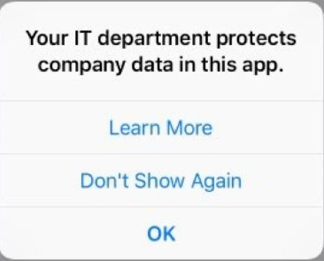

### 첫 앱 만들기 위한 기초지식

---

- 목표 및 할일 정리

  

  - View
    1. 타이틀 텍스트
    2. 이미지
    3. 가격 텍스트
    4. 리프레시 버튼
  - 기능
    - 리프레스 버튼 클릭 시 금액이 변경되기

- 버튼과 액션

  

  - View Controller는 페이지(스크린) 하나를 담당한다.

    - 이번 앱에서는 페이지가 하나만 필요하기 때문에 View Controller 하나만 사용

    - View Controller는 스토리보드에서 확인하는 Design part 그리고 거기에 연결된 Code part가 있다.

      

    - Design과 code는 연결되어 있기 때문에 새로운 ViewController를 만들었다면

      

      Identity 설정에서 새로 만든 ViewController의 이름을 넣으면 그쪽으로 스토리보드가 연동이 된다.
      
    - 버튼을 추가하고 버튼이 동작하도록 만들고 싶을 때는 Control을 누른 상태에서 Code로 드래그 하면 action이나 outlet을 설정 할 수 있다.

      
  
      드래그 한 뒤에  
  
      ``` swift
      @IBAction func name(_ sender: Any) {
        // code...
      }
      ```
  
      라는 method가 적용되면 code란에 원하는 동작을 작성하면 된다.
  
      - outlet은 텍스트 색상 또는 텍스트 크기 등 일부 제어 속성을 변경하는 경우에 사용
      - action은 트리거를 탐지하는 경우 (즉, 버튼을 누를 때) 사용
  
    - 이제 버튼을 눌렀을 때 Alert를 띄워봅시다.
  
      
  
      아까 작성해놓은 @IBAction에 코드를 작성하여 버튼을 눌렀을 때 alert가 띄워지는 코드를 작성해봅시다.
  
      ``` swift
      @IBAction func showAlert(_ sender: Any) {
              let alert = UIAlertController(title: "Hello", message: "My First App!!", preferredStyle: .alert)
       				// alert 창에 어떤 메세지를 담을지 alert란 변수에 정보를 저장
              let action = UIAlertAction(title: "OK", style: .default, handler: nil)
        			// OK라는 버튼을 누를 시 어떤 동작을 할지에 관한 내용을 action이라는 변수에 저장
       				// OK를 눌렀을 시 별 다른 행동을 취할 것이 없기 때문에 handler에는 nil을 입력
              alert.addAction(action)
        			// OK 버튼을 누를 수 있도록 Action 추가
              present(alert, animated: true, completion: nil)
        			// 위에서 만든 alert창을 띄우기
          }
      ```
  


- 문제 해결

  1. **오타**

     컴퓨터는 오타를 용납해주지 않는다. (자동완성 기능을 잘 활용하자)

     대소문자를 구분을 하기 때문에 대소문자 구분도 정확히!

  2. **코드가 바운더리 {} 밖으로 나가는 것을 조심하자**

  3. **연결 되어 있는 함수, 클래스명에 유의하자**

     버튼, 텍스트 등이 연결된 메소드의 이름이 다를 시 앱이 제대로 작동하지 않는다. (빌드에 성공은 하지만 트리거 작동 시 앱이 크래쉬 날 수도 있음)

  4. **warning (노란창)을 무시하지말자**

     빌드에도 문제가 없고 작동하는데 문제가 전혀 없지만 잠재적 버그의 이유가 될 수 있으니 이왕이면 잡는 것이 좋다.

  5. **오류 메세지를 잘 읽자!**

     문제가 발생 했을 시 오류 메세지를 읽으면 대부분 해결책이 적혀 있다.


- 앱 동작 방식 이해

  앱은 기본적으로 여러가지의 **Object**로 이루어진다. iOS에서 제공해주는 것도 있지만 가끔은 **필요에 따라 직접 만들어야 할 때도 있다.**

  Object들은 서로 메세지를 보내며 커뮤니케이션을 한다.

  위에 만든 버튼을 예를 들어서 사용자가 버튼을 **클릭** 했을 때, 버튼 -> 뷰컨트롤러에게 클릭이 되었다고 알려줌

  뷰컨트롤러는 showAlert 메소드를 실행함 그리고 UIAlertController에게 메세지를 보냄 그리고 alert 창에 띄워진다.

  **iOS 앱 자체는 이벤트 발생에 따라서 작동을 한다. 즉, 이벤트를 계속 기다리고 있다.**

<br>

---

<br>

### 첫 앱 만들기

---

뷰 구성하기

- UIKit(Framework) - UI Component들을 사용하기 위해 생긴 큰 공구통! (프레임워크는 단지 필요한 것을 모아놓은 공구함이다.)

  

  Label을 구성할 때도 옆에 속성을 보면 텍스트, 텍스트 크기, 굵기, 색깔 등등 많은 것을 지정 할 수 있다.

- 뷰의 위치

  뷰의 기준은 스크린의 좌측 상단으로 오른쪽으로 갈수록 X값이 +, 왼쪽으로 -, 밑으로 갈수록 Y값이 +, 위로 갈수록 -

<br>

---

<br>

### 오브젝트 이해하기

---

앱은 오브젝트로 구성된다고 했는데 오브젝트란 무엇인가!

오브젝트는 특정 역할을 수행하는 녀석이라고 생각할 수 있다. (각자 해야 할 일이 있음)

오브젝트는 두가지로 분류 할 수 있다.

* Data

  alert을 예로 들자면 title, message 같은 것들이 데이터에 속한다고 볼 수 있다.

  

* Method

  alert에서 OK 혹은 확인 버튼 같은 것을 눌렀을 때 수행되는 것을 의미한다.

<br>

---

<br>

### 문자열과 변수

---

String - 문자 하나하나의 나열

swift에는 문자열에 좋은 기능이 있다. String Interpolation (문자열 삽입)이라는 기능으로 문자열에 변수를 아주 쉽게 넣을 수 있다.

``` swift
var currentValue = 0
let message = "가격은 ₩\(currentValue)입니다."
```