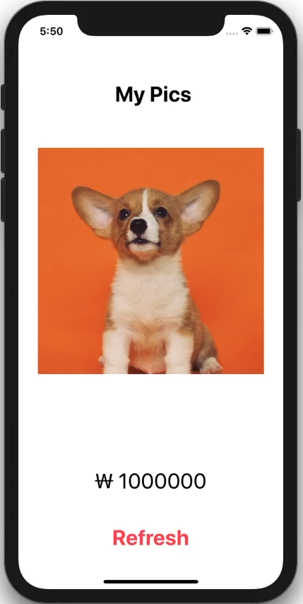
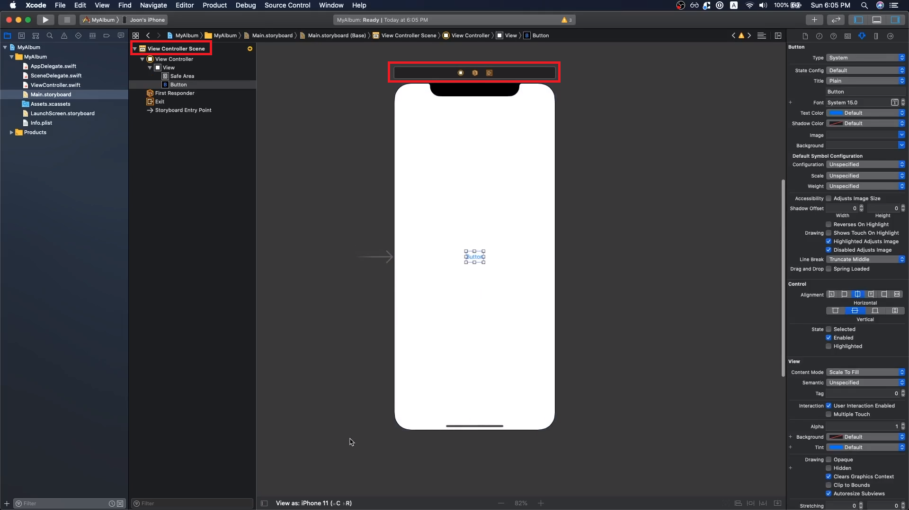
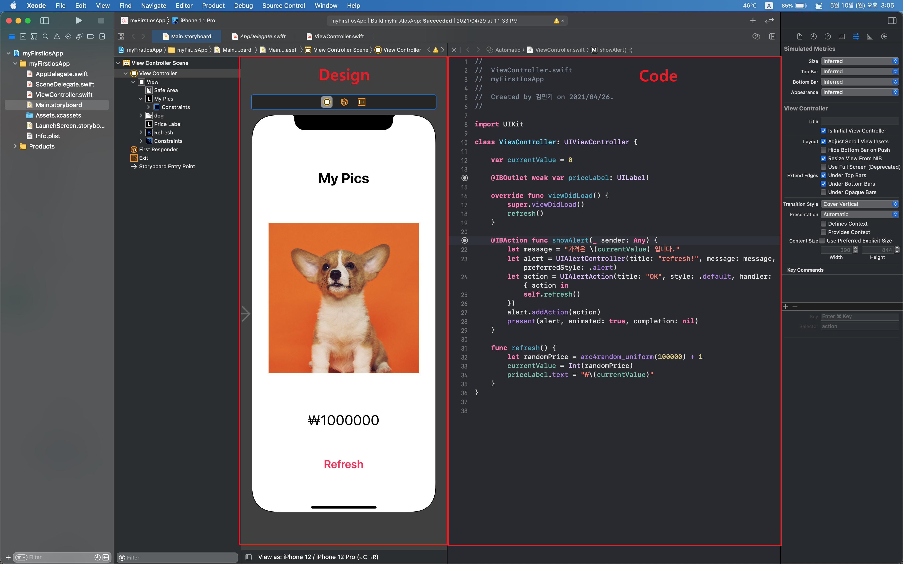
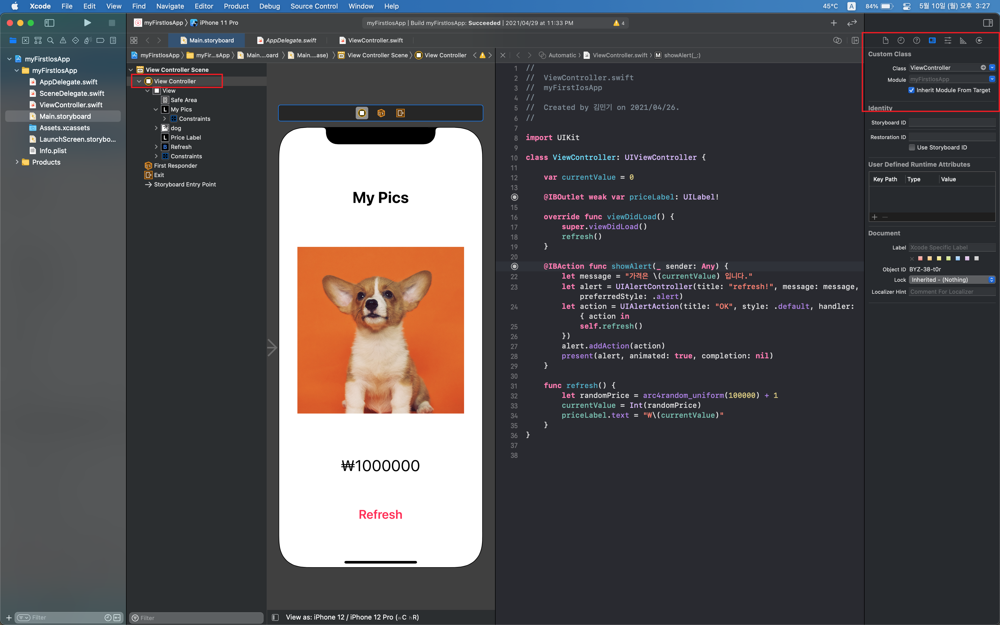
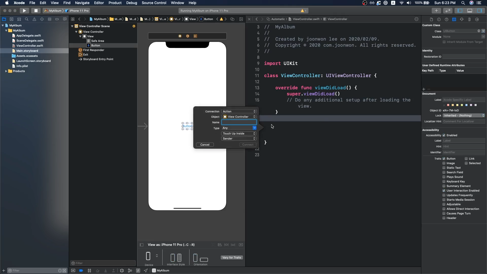

### 첫 앱 만들기

---

- 목표 및 할일 정리

  

  - View
    1. 타이틀 텍스트
    2. 이미지
    3. 가격 텍스트
    4. 리프레시 버튼
  - 기능
    - 리프레스 버튼 클릭 시 금액이 변경되기

- 버튼과 액션

  

  - View Controller는 페이지(스크린) 하나를 담당한다.

    - 이번 앱에서는 페이지가 하나만 필요하기 때문에 View Controller 하나만 사용

    - View Controller는 스토리보드에서 확인하는 Design part 그리고 거기에 연결된 Code part가 있다.

      

    - Design과 code는 연결되어 있기 때문에 새로운 ViewController를 만들었다면

      

      Identity 설정에서 새로 만든 ViewController의 이름을 넣으면 그쪽으로 스토리보드가 연동이 된다.
      
    - 버튼을 추가하고 버튼이 동작하도록 만들고 싶을 때는 Control을 누른 상태에서 Code로 드래그 하면 action이나 outlet을 설정 할 수 있다.

      
  
      - outlet은 텍스트 색상 또는 텍스트 크기 등 일부 제어 속성을 변경하는 경우에 사용
      - action은 트리거를 탐지하는 경우 (즉, 버튼을 누를 때) 사용
  
    - 
  
  - 기종 사이즈는 원하는대로
  
  

- 문제 해결
- 앱 동작 방식 이해
- ...

