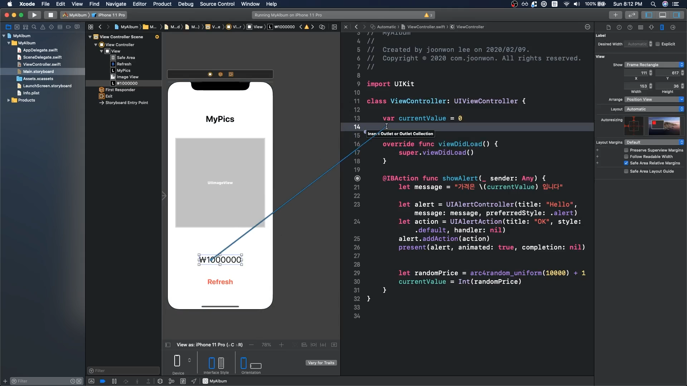
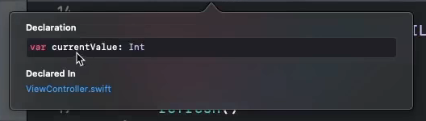
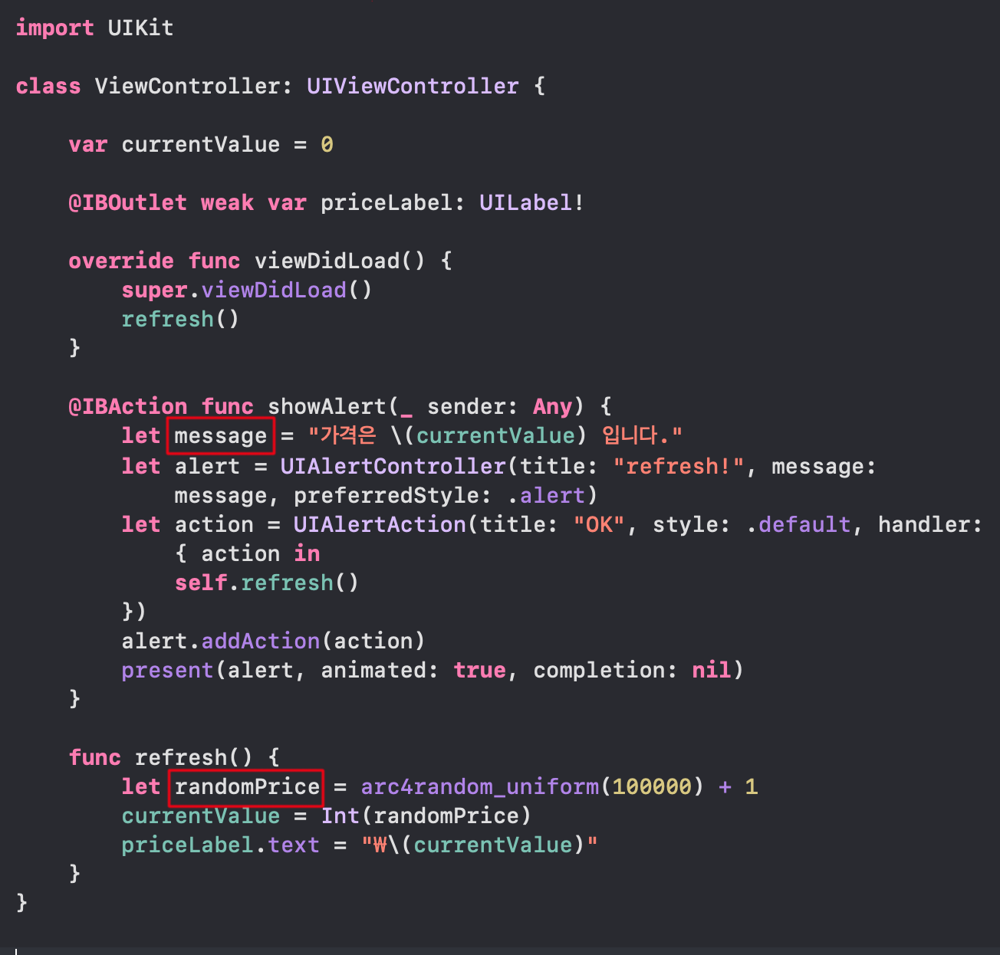
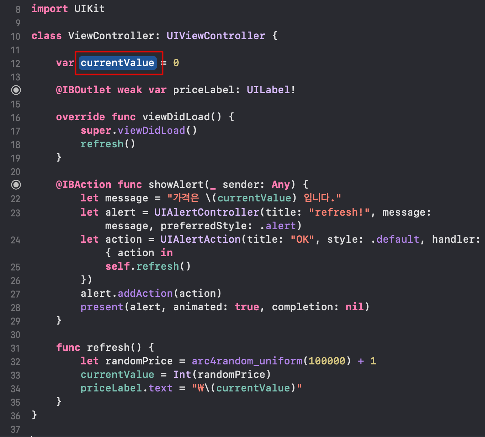

### outlet 연결하기

---



위 이미지 처럼 오브젝트를 control + 드래그 해서 코드 영역으로 끌어들이면 된다. (action과 비슷하다.)

``` swift
import UIKit

class ViewController: UIViewController {
    
    var currentValue = 0
    
    @IBOutlet weak var priceLabel: UILabel!
    // outlet을 연결 한 후에
  
    override func viewDidLoad() {
        super.viewDidLoad()
        priceLabel.text = "₩ \(currentValue)"
      // 이렇게 업데이트 할 수 있다.
    }
}
```

<br>

### Variable vs. Constant

---

#### var vs. let

var(variable) - 변수를 선언한 뒤에 값을 다시 변경할 수 있다.

let(constant) - 변수를 한번 선언하고 나면 값을 다시 변경할 수 없다.

**실무에서는 최대한 let(constant)를 사용하기를 권장**하고 있다.

var(variable)은 값 변경이 쉽기 때문에 버그가 쉽게 발생할 수 있기 때문이다.

<br>

### method 작성하기

---

오브젝트 파트에서 오브젝트는 데이터와 메소드로 구성된다고 했는데, 메소드는 기능을 수행하는 코드라고 했다.

``` swift
import UIKit
class ViewController: UIViewController {
  var currentValue = 0
  
  @IBOutlet weak var priceLabel: UILabel!
  
  override func viewDidLoad() {
    super.viewDidLoad()
    
    let randomPrice = arc4random_uniform(10000) + 1
    currentValue = Int(randomPrice)
    priceLabel.text = "₩ \(currentValue)"
  }
  
  @IBAction func showAlert(_ sender: Any) {
    let message = "가격은 \(currentValue) 입니다."
    let alert = UIAlertController(title: "Hello", message: message, preferredStyle: .alert)
    let action = UIAlertAction(title: "OK", style: .default, handler: nil)
    alert.addAction(action)
    present(alert, animated: true, completion: nil)
    
    let randomPrice = arc4random_uniform(10000) + 1
    currentValue = Int(randomPrice)
    priceLabel.text = "₩ \(currentValue)"
  }
}
```

위 코드를 살펴 보았을 때 동일한 코드가  **중복** 되는 것을 볼 수 있다.

중복코드가 많은 것은 **기술 부채**를 일으키기 때문에 이럴 때는 하나의 메소드로 만들면 된다.

``` swift
import UIKit
class ViewController: UIViewController {
  var currentValue = 0
  
  @IBOutlet weak var priceLabel: UILabel!
  
  override func viewDidLoad() {
    super.viewDidLoad()
    refresh()
  }
  
  @IBAction func showAlert(_ sender: Any) {
    let message = "가격은 \(currentValue) 입니다."
    let alert = UIAlertController(title: "Hello", message: message, preferredStyle: .alert)
    let action = UIAlertAction(title: "OK", style: .default, handler: nil)
    alert.addAction(action)
    present(alert, animated: true, completion: nil)
    refresh()
  }
  
  func refresh() {
    let randomPrice = arc4random_uniform(10000) + 1
    currentValue = Int(randomPrice)
    priceLabel.text = "₩ \(currentValue)"
  }
}
```

위와 같이 코드를 변경하면 동일한 코드를 refresh라는 메소드에 넣어서 간단하게 작성 할 수 있다.

``` swift
// 결국 method를 작성하는 방법은
func functionName(param) {
  code...
}
// 로 진행된다.
```

또한, 메소드와 함수는 최대한 **한가지 기능만**을 수행하게끔 만들어야 한다.

<br>

### 타입추론

---

타입추론이란 스위프트에서 제공하는 강력한 기능으로 `priceLabel: UILabel`처럼 타입을 써 놓을 수 있지만

반면 `var currentValue = 0` 같은 경우에는 타입을 적어놓지 않았다. 하지만 option키를 누르고 변수를 클릭해보면



처럼 Int type을 가지고 있는 것을 알 수 있다. 이처럼 타입을 굳이 쓰지 않아도 swift가 알아서 타입을 추론한다.

<br>

### Local vs. Instance 변수

---

Local변수 - 메소드 안에서만 사용 할 수 있는 변수



Instance변수 - 오브젝트 안에서 전반적으로 쓰이는 변수



<br>

### 클로져 기초

---

Closure = {	}

클로저라는 녀석은 쉽게 말해 **실행 가능한 코드 블럭**이다.

클로저는 변수처럼 파라미터로 함수에 넘겨줄 수도 있다.

``` swift
let action = UIAlertAction(title: "OK", style: .default, handler: nil)
// 위 코드에서 handler에 무언가를 넣으면 OK를 눌렀을 때 handler를 실행하라는 의미이다.
// 따라서 handler에 코드 블럭을 넣어준다.

let action = UIAlertAction(title: "OK", style: .default, handler: { action in
  self.refresh()
})
```

