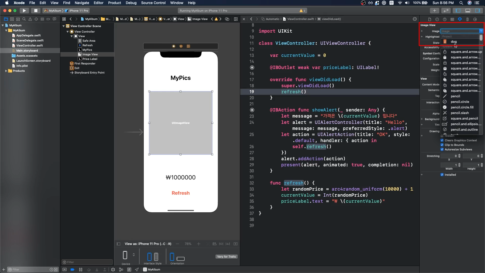

#### 스타일링

---

Image 기초 지식

​	기본적으로 아이폰는 3가지의 사이즈의 이미지에 대해서 받아 사용할 수 있다. (1x, 2x, 3x)

​	여기서 1x, 2x, 3x는 기본적으로 해상도를 나타낸다.

​	앱은 디바이스에 따라서 앱에서 표현하는 이미지를 다르게 사용한다.

​	1x는 저화질 3x는 고화질이다.

폴더에 들어있는 사진을 Assets에 드래그 하기만 하면 추가된다. 사진 title에 @2x라고 적으면 자동으로 2x에 배치된다.

그 후 이미지를 선택하는 부분에서 내가 추가한 이미지를 넣을 수 있다.

가끔 내가 만들어 놓은 이미지 사이즈에 이미지가 가득 차지 않을 때가 있는데 그 경우

Content Mode를 **Aspect Fill**로 변경하면 된다.

 

#### 오토레이아웃

---

오토레이아웃을 적용하지 않고 단지 오브젝트만 나열했을 경우 디바이스마다 보이는 모습이 다를 수 있다.

오토레이아웃을 적용할 경우에는 웬만하면 Add Missing Constraints를 사용하지 말고 직접 설정해야 한다.

