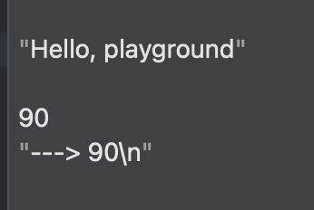
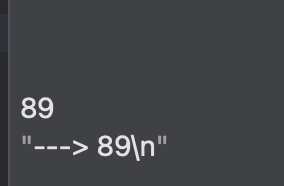
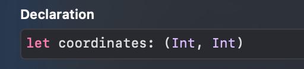

### Playground

---

Xcode에서 swift를 가지고 놀 수 있는 놀이터라고 볼 수 있다. 간단한 테스트 코드를 짤 때 이용하곤 한다.


<br>

### Comment

---

복잡한 코드에 경우 **설명을 달아둬서** 다른 개발자들이 읽기 편하게 하거나 **정보를 남겨두는 용도**로 사용한다.

이렇게 comment를 사용하면 해당 라인은 컴파일러가 **무시**하게 된다.

``` swift
import UIKit

var str = "Hello, playground"

let value = arc4random_uniform(100)
print("---> \(value)")
```

라는 코드를 실행 시키면



이렇게 출력이 되지만

``` swift
import UIKit

// var str = "Hello, playground"

let value = arc4random_uniform(100)
print("---> \(value)")
```

위 코드를 실행 시키면



"Hello,playground"를 무시하고 실행하는 것을 볼 수 있다.

코드 블럭을 잡은 뒤 command + /  를 하면 해당 블럭을 comment 시킬 수 있고, 여러 줄을 comment 하고 싶다면

``` swift
import UIKit

/*
var str = "Hello, playground"

let value = arc4random_uniform(100)
print("---> \(value)")
*/
```

위 코드 처럼 /* */ 를 이용하면 여러 줄을 comment 할 수 있다.

<br>

### Tuple

---

가끔 두개의 데이터가 동시에 필요할 때가 있다. 예를 들어 좌표를 표시하기 위해 x, y를 표시하는 경우 등 swift는 서로 관계가 있는 데이터를 표현 할 수 있다.

`let coordinates = (4, 6)` 이런 식으로 간단하게 표현 할 수 있는데



위 이미지가 튜플 타입을 보여준다.

하지만 이런식으로 작성하면 4, 6이 무엇을 표현하는지 확인하기 어렵기 때문에

`let coordinatesNamed = (x: 4, y: 6)` 이렇게 이름을 붙여줄 수가 있다.

``` swift
let coordinates = (4, 6)

let x = coordinates.0
let y = coordinates.1
// 이것 보다는

let coordinatesNamed = (x: 4, y: 6)

let x2 = coordinatesNamed.x
let y2 = coordinatesNamed.y
// 이 쪽이 확인하기가 편할 것이다.

let (x3, y3) = coordinatesNamed
// 이렇게 하면 위에 값을 가져오기 위하여 2줄이나 썼던 것을 한줄로 줄일 수 있다.
```

<br>

### Boolean

---

Boolean은 **true, false** 이 두가지 값만을 가지고 있다 마치 토글 버튼처럼 꺼짐, 켜짐 두개만 있다고 보면 된다.

Boolean 타입은 보통 **비교**를 할 때 많이 사용한다. 어떤 경우에는 참일 수도 있고, 어떤 경우에는 거짓일 수도 있는데

그런 경우 Boolean을 통해서 참일 때는 A코드를 거짓일 때는 B코드를 수행하는 등 **코드를 제어**할 수 있다.

``` swift
let isFourGreaterThanFive = 4 > 5

if isFourGreaterThanFive {
  print("---> 참")
} else {
  print("---> 거짓") // 위 명제는 거짓이기 때문에 이 코드가 수행이 된다.
}
```

``` swift
if 조건... {
  // 조건이 참인 경우에 수행하는 코드를 이곳
} else {
  // 그렇지 않은 경우에 수행하는 코드를 이곳
}
```

<br>

### Scope

---

**변수가 사용되는 범위**를 scope이라고 한다.

{ ... scope ... }

블록 안에 있는 것이 하나의 scope이고 scope 안에서 할당된 변수는 그 scope 안에서 사용이 가능하다.

``` swift
var hours = 50
let payperHour = 10000
var salary = 0

if hours > 40 {
    let extraHours = hours - 40
    salary += extraHours * payperHour * 2
    hours -= extraHours
  // extraHours는 현재 이 scope 안에서 할당 되었기 때문에 밖에서 사용 할 수 없다.
}

salary += hours * payperHour
```
