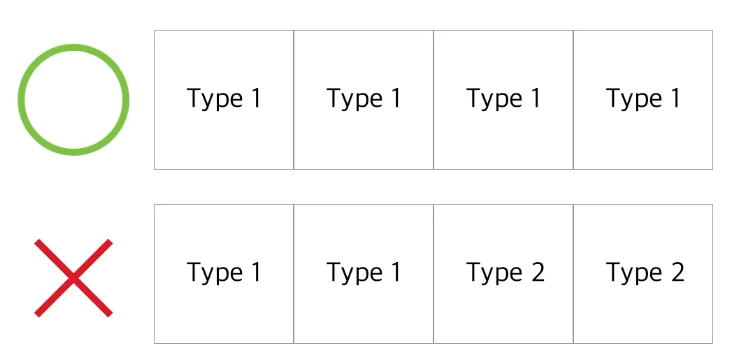
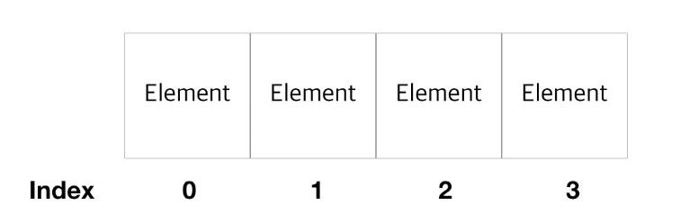
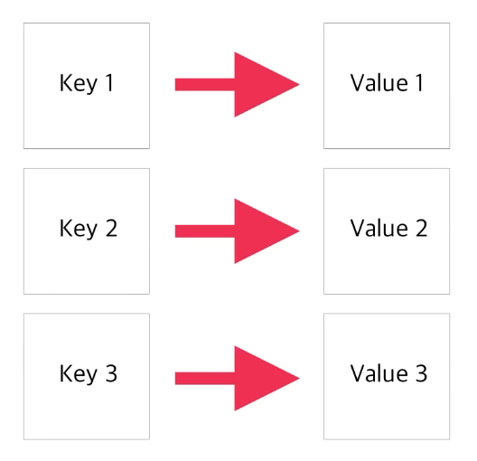
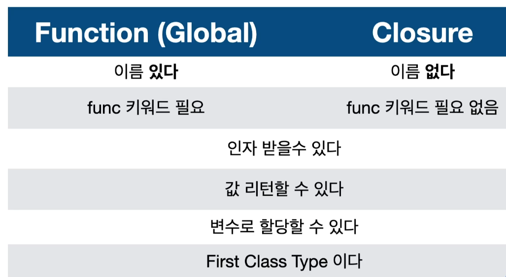

### Collection

---

많은 변수가 있을 때, **관리를 편하게** 할 수 있게끔 담을 수 있는 것이 collection이다.

* **Array**

  각 Element들을 **순서에 따라** 담을 수 있는 통이다

  Array를 사용할 때는 두가지만 기억하면 된다.

  1. 통에 담을 때는 같은 타입을 담아야 한다.

     

  2. Array라는 녀석은 순서(index)가 있다 * index는 0부터 카운트 한다.

     

  Array를 선언을 할 때는 두가지 방법이 있다.

  ``` swift
  let evenNumbers: [Int] = [2, 4, 6, 8] // 나는 이쪽을 더 선호한다.
  let evenNumbers: Array<Int> = [2, 4, 6, 8]
  ```

  Array에 값들을 추가로 넣는 방법 또한 여러가지다.

  ``` swift
  // 값을 추가하기 전에 주의 할 점은 Array를 constant로 만들면 추가할 수가 없다는 점이다.
  var evenNumbers: [Int] = [2, 4, 6, 8]
  
  evenNumbers.append(10)	//낱개를 추가할 때
  evenNumbers += [12, 14, 16]	// 여러개를 추가할 때 1
  evenNumbers.append(contentsOf: [18, 20])	// 여러개를 추가할 때 2
  ```

  Array에 쓸 수 있는 몇가지 기능이 더 있다.

  ``` swift
  let isEmpty = evenNumbers.isEmpty
  // isEmpty를 사용하면 array가 비어 있다면 true를 비어있지 않다면 false 값을 가진다.
  
  evenNumbers.count
  // count를 사용하면 현지 array가 가지고 있는 element의 갯수를 알려준다.
  
  evenNumbers.min()	// array의 값들이 대소 비교가 가능할 때 최소값을 뽑을 수 있다.
  evenNumbers.max() // array의 값들이 대소 비교가 가능할 때 최대값을 뽑을 수 있다.
  
  evenNumbers[0...2]	// range로 값을 뽑을 수도 있다.
  
  evenNumbers.contain(3)	// array 안에 특정 값이 들어있는지 확인하고 싶을 때 사용
  
  evenNumbers.insert(0, at: 0)	// 특정 값을 특정 인덱스에 삽입할 수 있음 (0을 0번째 인덱스에)
  
  evenNumbers.swapAt(0, 1)	// 인덱스끼리 자리 교환도 가능하다.
  ```

  더 많은 기능들도 있으니 공문을 찾아보는게 좋을 듯 싶다.

  

* **Dictionary**

  Dictionary는 array와 다르게 순서가 없고 **key와 value로 이루어진 짝** 이다.

  

  여기서 **key는 유니크** 해야한다. 즉, **key는 유일**해야한다는 말이다.

  dictionary도 선언하는 방법이 크게 다르지 않다.

  ``` swift
  var scoreDic: [String: Int] = ["Jason": 80, "Jay": 95, "Jake": 90]
  var scoreDic: Dictionary<String, Int> = ["Jason": 80, "Jay": 95, "Jake": 90]
  // dictionary는 key와 value이기 때문에 타입을 두 개 적어주면 된다.
  // 첫번째와 두번째의 다른 점은 타입을 나눌 때 두번째는 ' , ' 를 사용한다는 점이다.
  // 이렇게 선언하면 된다.
  ```

  **dictionary는 옵셔널**이기 때문에 값을 가져올 때 바인딩을 통해 안전하게 가져올 수 있다.

  ``` swift
  if let score = scoreDic["Jason"] {
    print(score)
  } else {
    // none score
  }
  ```

  array에서 설명했던 추가 기능들도 **Collection 공통 프로퍼티**라 dictionary도 사용 가능하다.

  ``` swift
  scoreDic.isEmpty	// dictionary가 비어있는지 확인
  scoreDic.count	// dictionary에 값이 몇개가 들어있는지 확인
  ```

  ``` swift
  // 기존 사용자 업데이트
  scoreDic["Jason"] = 99	// 기존에 사용자가 있는 상태라면 정보가 업데이트 된다.
  
  // 사용자 추가
  scoreDic["Jack"] = 100	// 기존에 사용자가 없다면 새로 추가된다.
  
  // 사용자 제거
  scoreDic["Jack"] = nil	// value를 nil로 변경한다면 사용자 정보는 사라진다.
  
  for key in scoreDic.keys {
    print(key)
  }
  // .keys를 이용하면 dictionary의 key만 골라서 볼 수 있다.
  // 다만 dictionary는 아이템의 순서가 없기 때문에 출력되는 순서는 보장되지 않는다.
  ```

  

* **Set**

  Set은 **순서가 없고 유일한 값**을 갖는다.

  Set은 **중복이 없는 유니크한 아이템들을 관리**할 때 사용한다.

  ``` swift
  var someSet: Set<Int> = [1, 2, 3, 1]	// 1, 2, 3, 1
  var someArray: Array<Int> = [1, 2, 3, 1]	// 1, 2, 3
  // 겉보기에는 array와 선언하는 것에 차이가 없어 보이지만 
  ```

  위에서도 얘기했 듯 Set 또한 Collection에 쓸 수 있는 공통 프로퍼티를 사용 할 수 있다.

  ``` swift
  someSet.isEmpty
  someSet.count
  
  someSet.contains(4)
  // 등등 많이 있다.
  ```

<br>

<br>

### Closure

---

closure를 쉽게 생각하자면 **이름이 없는 method**다.

``` swift
var multiplyClosure: (Int, Int) -> Int = { (a: Int, b: Int) -> Int in
  return a * b
}	// 위 형태가 기본 형태이다.

var multiplyClosure: (Int, Int) -> Int = { a, b in
  return a * b
}	// 이런 식으로 축약 할 수도 있다.
// 위 형식을 선호한다.

var multiplyClosure: (Int, Int) -> Int = { &0 * &1 }
// 극한으로 줄이면 retrun도 없애고 이런 식으로 축약해서 쓸 수 있다.
// 개인적으로 너무 줄이면 의미를 알기 어려울 수도 있어 사용하지 않는다.
```

실무에서 function이나 method에 **인자로 closure를 받는 상황**이 상당히 많다.

``` swift
var multiplyClosure: (Int, Int) -> Int = { a, b in
  return a * b
}

func operateTwoNum(a: Int, b: Int, operation: (Int, Int) -> Int) -> Int {
  let result = opeartion(a, b)
  return result
}
operateTwoNum(a: 4, b: 2, operation: multiplyClosure)
// 위 처럼 closure를 미리 만들어서 함수의 인자로 추가할 수도 있다.

operateTwoNum(a: 4, b: 2) { a, b in
  a / b
}
// 이런 식으로 즉석으로 closure를 만들어 적용시킬 수도 있다.
// 이렇게 그 때 그 때 끼워넣을 수 있다는 점이 closure의 강점이다.
```

closure라고 해서 꼭 input, output이 있어야 하는 것은 아니다.

``` swift
let voidClosure: () -> Void = {
  print("iOS 개발자")
}

voidClosure()
// 이렇게도 작성이 가능하다.
```

<br>

#### Capturing Value

간단하게 설명하자면 **closure에 잡힌 변수는 scope 밖에서도 사용이 가능**하다는 것이다.

``` swift
var count = 0

let incrementer = {
  count += 1	// 인자로 넘겨주지 않았지만 closure가 capture해서 사용이 가능하다.
}

incrementer()
incrementer()
incrementer()
incrementer()

count	// 4
```

이것은 큰 장점이 되기도 하지만 문제가 될 수도 있기 때문에, 되도록이면 명시적으로 인자를 설정하는 것이 좋다.

<br>

#### Closure 보강

사실 아주 정확히는 **함수 (function)은 closure의 한가지 타입**이다.

closure는 크게 3가지 타입이 있다.

* Global 함수

* Nested 함수

* Closure Expressions

  지금 정리하고 있는 closure는 정확히는 여기에 속한다.

function과 closure의 공통점과 차이점이다



여기서 **First Class Type**이란 무엇인가

* 변수에 할당할 수 있다.
* 인자로 받을 수 있다.
* 리턴 할 수 있다.

<br>

그래서 closure는 **어떤 때에 자주 사용하는가!**

* Completion Block

  어떤 테스크가 완료 되었을 때, closure가 실행이 된다.

  어떤 동작을 함에 있어서, 해당 동작이 종료가 되면 그 때 closure를 실행시킨다는 것이다.

* Higher Order Functions

  Input으로 함수를 받을 수 있는 유형의 함수를 뜻한다. (인자를 함수로 받을 수 있는 녀석)

<br>

**Closure Expression Syntax** 는 이렇게 생겼다

``` swift
{ ( parameters) -> return type in
  statements
}
```

 또한 함수의 인자 중 **closure가 마지막 인자**라면 조금 다르게 표현도 가능하다 **(Trailing Closure)**

``` swift
func someSimpleFuction(message: String, choSimpleClosure: () -> Void) {
  print("함수에서 호출 되었고, msg is \(message)")
  choSimpleClosure()
}

someSimpleFunction(message: "COVID", choSimpleClosure: {
  print("Bye COVID")
})
// 이렇게 평범하게 호출할 수 있지만, 만약 인자의 값이 많고, closure가 인자의 맨 마지막이라면

someSimpleFunction(message: "COVID") {
  print("Bye COVID")
}
// 이렇게 표현해서 작성도 가능하다.
```

